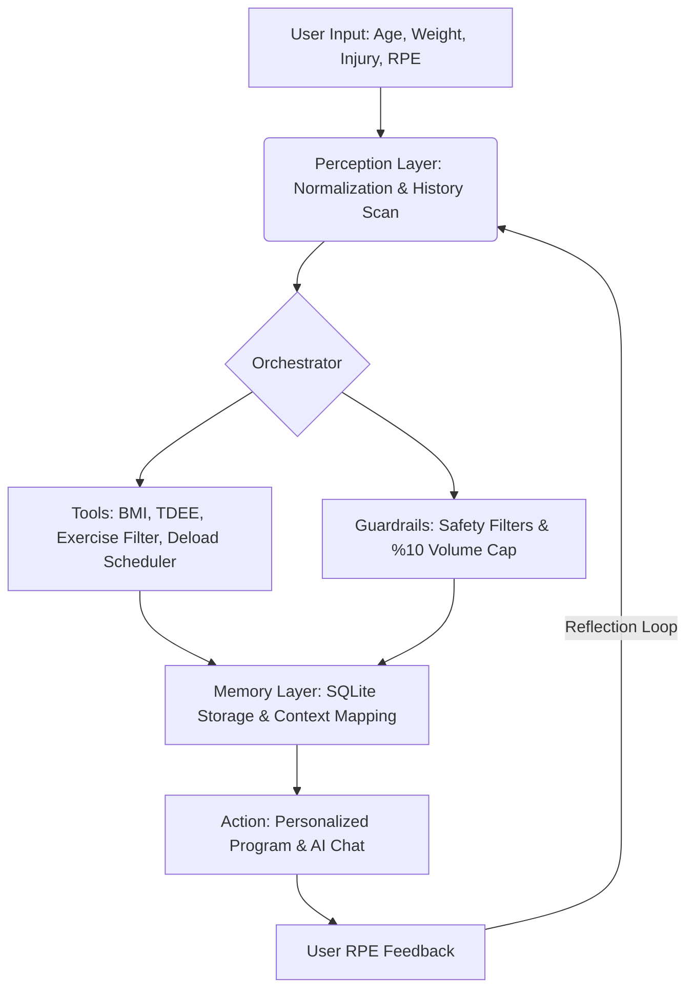

# Fitness Coach Agent (AI Personalized Workout & Reflection System)

This project is a 100% locally running intelligent fitness coach AI agent, designed for the "Concierge Agents" category of the **"AI Agents: Intensive Vibe Coding Capstone Project"** competition, organized in partnership with Google and Kaggle.

The application operates completely on your own machine without requiring cloud-based API keys (OpenAI, Gemini, etc.), using local formulas and optional local LLM (Ollama) support.

---

## 🚀 Quick Start (Installation)

### Requirements
- **Node.js (v18+)** and **npm** must be installed on your computer.

### 1. Installation & Running
Run the following commands in order within the project root directory:

```bash
# Install dependencies
npm install

# Start the developer server
npm run dev
```

You can open the application by navigating to [http://localhost:3001](http://localhost:3001) in your browser.

---

## 🤖 Optional Local LLM Integration (Ollama)

The application manages the artificial intelligence layer in dual-mode:
1. **Deterministic Engine (Always active):** Numerical calculations (TDEE, BMI, 1RM), exercise library filtering, deload planning, and weekly load increase/decrease choices are computed entirely by the rule-based engine. This prevents numerical hallucinations or safety errors in your plans.
2. **LLM Natural Language Layer (Optional):** If **Ollama** is installed and running on your computer, the application automatically detects it. Motivational messages and AI coach chat responses are generated by the local LLM (e.g., `llama3`, `gemma2`, `phi3`). If Ollama is offline, the application falls back to a rich template pool without any interruption.

### To Connect Ollama:
1. Download and install the software from the [Ollama official website](https://ollama.com).
2. Pull your model of choice from your terminal (for example):
   ```bash
   ollama run llama3
   ```
3. Restart the application or click the "Refresh" button on the Settings page. The model list will load automatically.

---

## 🛠️ Tech Stack

- **Framework:** Next.js 14+ (App Router, TypeScript)
- **Database:** SQLite (zero-configuration, single-file database via `better-sqlite3`)
- **Styling:** Tailwind CSS (primarily dark theme, premium glassmorphic design)
- **Animation:** Framer Motion (smooth onboarding wizard transitions and circular rest timer)
- **Charts:** Recharts (weight trend and total training volume logs)
- **State Management:** Zustand (client-side global state)

---

# 🧠 Agent Design Document

Fitness Coach Agent is designed as a fully autonomous agent architecture with action-reaction and **Reflection** loops, moving beyond simple static form-filling apps.



### 1. Perception - `lib/agent/perception.ts`
Receives physical metrics entered by the user during onboarding and translates them into BMI and TDEE values. In addition, at the beginning of each workout, it queries the SQLite memory to retrieve and normalize recently completed workouts, weight history, and active training streaks.

### 2. Tools - `lib/agent/tools/`
Independent, type-safe pure functions:
- **BMI/TDEE/1RM Calculators:** Employs Epley and Mifflin-St Jeor formulas.
- **Exercise Selector:** Filters exercises from the 85+ movement JSON database matching the user's available equipment and avoiding injury triggers.
- **Periodization Planner:** Determines set and rep schemes based on user goals.
- **LLM/Template Motivation Engine:** Generates the most contextual motivational output.

### 3. Guardrails & Safety - `lib/agent/guardrails.ts`
Safety layer established to protect user health:
- **Input Validation:** Rejects unrealistic age, height, and weight inputs.
- **Injury Avoidance:** Completely blocks exercises that load joints or muscle groups flagged by the user as injured.
- **Progressive Overload Cap:** Limits weekly weight increments to a maximum of **10%** per exercise. If exceeded, it automatically caps weights to a safe threshold.
- **Medical Disclaimer:** Renders a standard medical disclaimer at the bottom of all views.

### 4. Memory - `lib/agent/memory.ts` & SQLite
- **Short-Term Memory:** Handles active sets and rest timer values in the browser via Zustand.
- **Long-Term Memory:** Locally preserves `UserProfile`, `WorkoutPlan`, `WorkoutLog`, `ProgressSnapshot`, and `ChatMessage` tables on the device using SQLite. The agent reads this long-term memory as context for every new weekly plan generation.

### 5. Reflection Loop (Self-Adjustment / Adaptability)
The agent's key feature is analyzing the **RPE (Rate of Perceived Exertion)** values reported for completed workouts:
- If a user completes an exercise set and flags it as "too easy" (low RPE), the agent increases the load for that exercise by **2.5% to 5%** in the following week (Progressive Overload).
- If RPE is too high or strength gains have stalled for 3 consecutive weeks (Plateau), the system automatically schedules a **Deload Week** (reducing sets and lowering weights by 20%).

---

## 🔒 Privacy and Security (Privacy-by-Design)

This project is built on the principles of local data privacy. Your profile, training history, and chat logs are never sent to external cloud servers. All data is saved locally on your device in the `fitness_coach.db` file. To prevent data loss, you can export and download your JSON backup from the Settings page.
